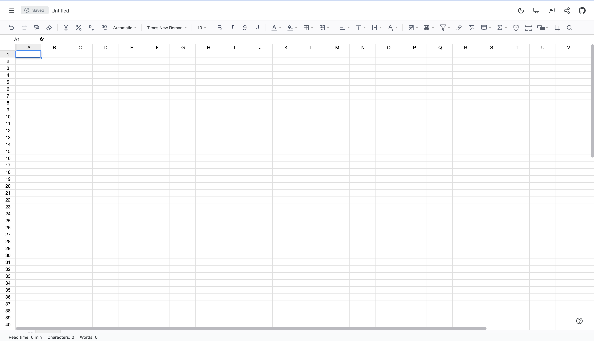

# Dsheet Editor

[dsheet.new](http://dsheet.new/) is your onchain, privacy-first alternative to G\**gle D*cs: peer-to-peer, end-to-end encrypted, and decentralized. It enables secure, real-time, and async collaboration without compromising user privacy.



This repository contains:

- `/package` – The core package code.
- Example & demo source code to showcase dSheets functionalities.

## Usage

### Prequisites

To use dSheet, ensure your project is set up with Tailwind CSS and have a Tailwind configuration file.

### Install & import

Add the following imports :

```javascript
import { DSheetEditor } from '@fileverse-dev/dsheet';
import '@fileverse-dev/dsheet/styles'; // in App.jsx/App.tsx
```

### Update Tailwind Config

In your tailwind config, add this line to content array :

`@fileverse-dev/dsheet/dist/index.es.js`

You should now be set to use dSheets!

# dSheetProps Interface

The `DsheetProps` interface is a TypeScript interface that defines the properties for a page-related component. It includes properties for handling preview mode, managing publishing data, and optionally storing metadata and content associated with the page.

## Core Props

| Property                 | Type                                          | Description                                     |
| ------------------------ | --------------------------------------------- | ----------------------------------------------- |
| `portalContent`         | `JSONContent`                                 | Initial content of the editor                   |
| `onChange`               | `(changes: JSONContent, chunk?: any) => void` | Callback triggered on editor content changes    |
| `ref`                    | `React.RefObject`                             | Reference to access editor instance             |
| `isReadOnly`          | `boolean`                                     | Controls if editor is in preview/read-only mode |
| `allowComments`          | `boolean`                                     | Enables commenting in read-only mode - adds comment icon to toolbar and context menu (requires `isReadOnly=true`) |
| `dsheetId`          | `string`                                     | Used as room id for collaboration |

### Steps to run this example locally

- `cd demo`
- `npm i`
- `npm run dev`

It will open up a vite server, that will have the Dsheet Editor.

⚠️ This repository is currently undergoing rapid development, over the time more customization and API will be added.