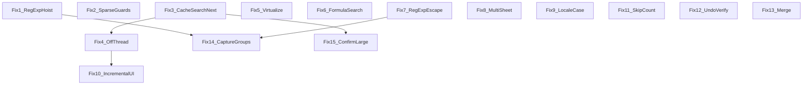

# Search/replace module — feasibility audit

This document audits the dSheet search/replace stack for **15** proposed performance and correctness fixes: effort, risk, blockers, dependencies, and recommendations. It is an **assessment only** (no implementation checklist implied).

## Third-party libraries vs current codebase

You do **not** need third-party libraries for a **meaningfully better** find/replace experience. Most fixes can ship with plain TypeScript, the existing `flowdata` model, `valueShowEs` / `getCellValue`, React, Immer / `setContextWithProduce`, and `@fileverse/ui`.

**Optional** libraries:

- **Virtualized results:** `@tanstack/react-virtual` or `react-window` saves time for large result lists; a minimal hand-rolled window is also viable.
- **Off–main-thread search:** Browser **Web Workers** (no npm package required); complexity is design and serialization / duplicated display logic, not “pick a library.”
- **Fuzzy / typo-tolerant / ranked search:** If product goals go beyond substring + regex (e.g. Fuse.js, FlexSearch, MiniSearch), that is a **product** choice, not a limitation of the current stack.

---

## Codebase structure

### Line counts (`wc -l`, approximate snapshot)

| File | Lines |
|------|------:|
| `src/sheet-engine/core/modules/searchReplace.ts` | ~671 |
| `src/sheet-engine/core/modules/format.ts` | ~324 |
| `src/sheet-engine/core/modules/cell.ts` | ~2339 |
| `src/sheet-engine/core/modules/selection.ts` | ~3395 |
| `src/sheet-engine/core/context.ts` | ~721 |
| `src/sheet-engine/core/events/keyboard.ts` | ~1321 |
| `src/sheet-engine/react/components/SearchReplace/index.tsx` | ~385 |
| `src/sheet-engine/react/components/SheetOverlay/index.tsx` | ~1052 |
| `src/sheet-engine/core/utils/index.ts` | ~552 |

### How pieces connect

- **Entry:** `keyboard.ts` sets `ctx.showSearch` / `ctx.showReplace` on Ctrl+F / Ctrl+H.
- **Mount:** `SheetOverlay/index.tsx` renders `<SearchReplace />` when either flag is true.
- **Core:** `searchReplace.ts` — `getSearchIndexArr`, `searchNext`, `searchAll`, `replace`, `replaceAll`; uses `getFlowdata(ctx)` (`context.ts` → `ctx.luckysheetfile[i].data`), `valueShowEs` (`format.ts`), `setCellValue` (`cell.ts`), `normalizeSelection` / `scrollToHighlightCell` (`selection.ts`).
- **UI:** `SearchReplace/index.tsx` — local state for query, modes, results; calls core inside `setContext` from `Workbook` (**`setContextWithProduce`**, Immer `produceWithPatches`).
- **Utils:** `getRegExpStr`, `chatatABC`, `replaceHtml`, `isAllowEdit` from `core/utils/index.ts`.

**Dependencies / complications:** `lodash`, `immer`, optional `ctx.hooks.updateCellYdoc`; `Hooks` in `core/settings.ts` includes `cellDataChange`, `afterUpdateCell`, etc. **No** `react-window` / `@tanstack/react-virtual` in package.json at audit time. **No** active Web Workers in this package (only commented references elsewhere).

---

## Fix assessments

### P0

**Fix 1 — Hoist `RegExp` in `getSearchIndexArr` (regex branch)**

- **Files touched:** `searchReplace.ts` (also `replace` / `replaceAll` construct `RegExp` per operation; less critical than inner loop).
- **LOC (estimate):** ~10–25.
- **Dependencies / side effects:** Pattern/flags depend only on `searchText`, `caseCheck`, `regCheck`; stable across `r,c` loops.
- **Risk:** **Medium** if naïve: a **new** `RegExp` is created per cell today, so `lastIndex` resets. Reusing one **global** regex with **`.test()`** across cells can **skip matches** (`lastIndex`). Mitigation: `String.prototype.search(reg) !== -1`, or `reg.lastIndex = 0` before each `test`, or a non-`g` test regex.
- **Blocked?** No — with a safe match API.
- **Effort:** Small.
- **Approach:** Hoist compiled regex once per `getSearchIndexArr` when `regCheck`; avoid `.test()` + `/g` on a shared instance without resetting.

---

**Fix 2 — Early-exit empty / sparse cells**

- **Files touched:** `searchReplace.ts`.
- **LOC:** ~5–15.
- **Dependencies:** `valueShowEs` / `getCellValue` for null cells; loop already skips `cell == null` before `valueShowEs`. **Gap:** missing `flowdata[r]` can throw before that check.
- **Risk:** Low.
- **Blocked?** No.
- **Effort:** Trivial / small.
- **Approach:** `if (!flowdata[r]) continue` (and optional chaining) before `flowdata[r][c]`.

---

**Fix 3 — Cache search results across `searchNext`**

- **Files touched:** `searchReplace.ts`, possibly `SearchReplace/index.tsx` or `GlobalCache.searchDialog` in `types.ts`.
- **LOC:** ~40–120.
- **Dependencies:** `searchNext` recomputes `getSearchIndexArr` every click; cursor is implicit via `luckysheet_select_save`. Invalidate on: query text, check modes, sheet switch (`currentSheetId`), data edits (`hooks.cellDataChange` / `afterUpdateCell`).
- **Risk:** Medium (stale index → wrong highlight).
- **Blocked?** No; needs one source of truth for cache + cursor.
- **Effort:** Medium.
- **Approach:** Keyed cache `{ hash, arr, cursorIndex }`; invalidate on key change or hooks.

---

**Fix 4 — Off-main-thread search**

- **Files touched:** New worker + glue; `searchReplace.ts`; possibly duplicated minimal display-string logic for worker.
- **LOC:** Large (100–400+).
- **Dependencies:** `flowdata` is usually plain data; `valueShowEs` chain pulls deep from `cell.ts` — hard to run unchanged in a worker. **No** existing Worker infra to reuse.
- **Risk:** High (correctness, bundle, sync with edits).
- **Blocked?** **Spike first:** clone cost vs duplicated `valueShowEs`-lite.
- **Effort:** Large.
- **Fallback:** chunked scan + `requestAnimationFrame` / `setTimeout` → async API or callbacks.

---

**Fix 5 — Virtualize results table**

- **Files touched:** `SearchReplace/index.tsx`, optionally `package.json` for a dependency.
- **LOC:** ~50–150.
- **Dependencies:** Full `searchResult.map` in scroll container with custom `onWheel` and row `onClick` — virtualization must preserve scroll, focus, and navigation to cells.
- **Risk:** Medium (layout, header, `@fileverse/ui` `Table`).
- **Blocked?** No.
- **Effort:** Medium.
- **Approach:** Small custom window or add `@tanstack/react-virtual` / `react-window` after bundle review.

---

### P1

**Fix 6 — Search formula text (`cell.f`)**

- **Files touched:** `searchReplace.ts`, `SearchReplace/index.tsx`, locale strings.
- **LOC:** ~30–80.
- **Dependencies:** `isFormulaCell` already exists; display vs formula paths need clear UX.
- **Risk:** Medium.
- **Blocked?** No.
- **Effort:** Small / medium.

---

**Fix 7 — Improve `getRegExpStr` escaping**

- **Files touched:** `core/utils/index.ts`; tests.
- **LOC:** ~15–40.
- **Dependencies:** Current code handles `~*`, `~?`, `.`, `*`, `?` only; not `^ $ ( ) [ ] { } | + \` etc. Wildcard `*` → `.*` is intentional.
- **Risk:** Medium–high for users relying on current “regex” semantics.
- **Blocked?** Product decision (wildcard vs full regex).
- **Effort:** Small for escapes; medium for compatibility.

---

**Fix 8 — Search across all sheets**

- **Files touched:** `searchReplace.ts`, UI.
- **LOC:** ~60–200.
- **Dependencies:** `getFlowdata` is **current sheet only**; each `luckysheetfile[i].data` can be passed to `valueShowEs(r,c,d)`. Extend `SearchResult` with correct `sheetId` / name (today `searchAll` tags current sheet).
- **Risk:** Medium (perf, inactive sheet data).
- **Blocked?** No for read path; clarify `searchNext` workbook vs sheet scope.
- **Effort:** Medium.

---

**Fix 9 — Locale-aware case folding**

- **Files touched:** `searchReplace.ts`; pass `ctx.lang` into helpers.
- **LOC:** ~10–30.
- **Dependencies:** `locale/index.ts` uses `ctx.lang`; no widespread `toLocaleLowerCase` in repo at audit time.
- **Risk:** Low–medium (linguistic edge cases vs rest of app using `toLowerCase`).
- **Blocked?** No.
- **Effort:** Small.

---

**Fix 10 — Incremental as-you-type search**

- **Files touched:** `SearchReplace/index.tsx`.
- **LOC:** ~20–50.
- **Dependencies:** `onChange` exists but does not run full search; debounced `searchAll` can **block** main thread without Fix 4 / chunking.
- **Risk:** Medium (jank).
- **Blocked?** Soft-blocked by perf (debounce + cancel + loading state).
- **Effort:** Small code; medium tuning.

---

### P2

**Fix 11 — Warning on skipped formula cells**

- **Files touched:** `searchReplace.ts`, locale, UI.
- **LOC:** ~15–40.
- **Dependencies:** `replace` returns `null` on formula skip with no count; `replaceAll` silently `continue`s on formulas.
- **Risk:** Low.
- **Blocked?** No.
- **Effort:** Small.

---

**Fix 12 — Undo support for replace**

- **Files touched:** Often **none** if behavior already correct.
- **LOC:** 0–30.
- **Dependencies:** `SearchReplace` uses `setContextWithProduce`; `filterPatch` (`patch.ts`) keeps `luckysheetfile` patches except `luckysheet_select_save`. Cell mutations from `setCellValue` should produce undoable patches; one `replaceAll` = one Immer transaction = one undo step.
- **Risk:** Low; verify with tests.
- **Blocked?** Verify only.
- **Effort:** Trivial / small (spike + regression tests).

---

**Fix 13 — Merged cell handling**

- **Files touched:** `searchReplace.ts`, possibly `cell.ts` merge helpers.
- **LOC:** ~30–100.
- **Dependencies:** Merge slaves may be null / non-primary while display is on master — search can miss visible text; `setCellValue` on slaves may be wrong.
- **Risk:** Medium–high.
- **Blocked?** Needs **product rules** for master vs slave.
- **Effort:** Medium.

---

**Fix 14 — Capture groups in regex replace**

- **Files touched:** `searchReplace.ts`, `getRegExpStr`, tests.
- **LOC:** 0–small.
- **Dependencies:** `String.prototype.replace` already supports `$1`, `$2`. `getRegExpStr` does not strip `(` `)`; it forces `.` → `\.` (dot is literal in “regex” mode).
- **Risk:** Low for `$1`; documentation matters.
- **Blocked?** No.
- **Effort:** Trivial (tests + docs).

---

**Fix 15 — Confirmation for large Replace All**

- **Files touched:** `SearchReplace/index.tsx`.
- **LOC:** ~15–40.
- **Dependencies:** `useAlert` supports `'yesno'` (`useAlert.tsx`); pre-count via `getSearchIndexArr` or Fix 3 cache.
- **Risk:** Low.
- **Blocked?** No; **independent** of Fix 12.
- **Effort:** Small.

---

## Dependency chart

**Notes**

- **Fix 3 vs 4:** Cache on main thread; worker posts back new arrays — share invalidation / generation tokens to avoid stale reads.
- **Fix 10 vs 4:** Incremental search benefits strongly from async/chunked scan.
- **Fix 12 vs 15:** No strict ordering.

---

## Summary table

| Fix # | Title | Effort | Risk | Blocked? | Recommendation |
|------:|-------|--------|------|----------|----------------|
| 1 | Hoist RegExp | Small | Medium | No (use `search` or reset `lastIndex`) | **Do it** |
| 2 | Early-exit / sparse rows | Trivial–Small | Low | No | **Do it** |
| 3 | Cache `searchNext` | Medium | Medium | No | **Do it** (define invalidation) |
| 4 | Web Worker search | Large | High | Spike / worker-safe display | **Spike first** or defer |
| 5 | Virtualize results | Medium | Medium | No | **Do it** if large lists are common |
| 6 | Search in formulas | Small–Medium | Medium | No | **Do it** |
| 7 | Regex escaping | Small–Medium | Medium–High | Product semantics | **Do it after** UX decision |
| 8 | All-sheet search | Medium | Medium | No | **Do it** (define `searchNext` scope) |
| 9 | Locale case fold | Small | Low–Medium | No | **Do it** |
| 10 | Incremental search | Small–Medium | Medium | Perf | **Do it after** Fix 4 or chunking |
| 11 | Skipped formula count | Small | Low | No | **Do it** |
| 12 | Undo for replace | Trivial–Small | Low | Verify | **Verify + tests** (likely already OK) |
| 13 | Merged cells | Medium | Medium–High | Product rules | **Spike** merge resolution |
| 14 | Capture groups | Trivial | Low | No | **Do it** (tests/docs) |
| 15 | Large replace confirm | Small | Low | No | **Do it** |

---

## Extra correctness note

If **Fix 1** hoists a **global** regex, avoid **`.test()` in a loop** without resetting `lastIndex`; per-cell `new RegExp` today accidentally avoids that bug.
